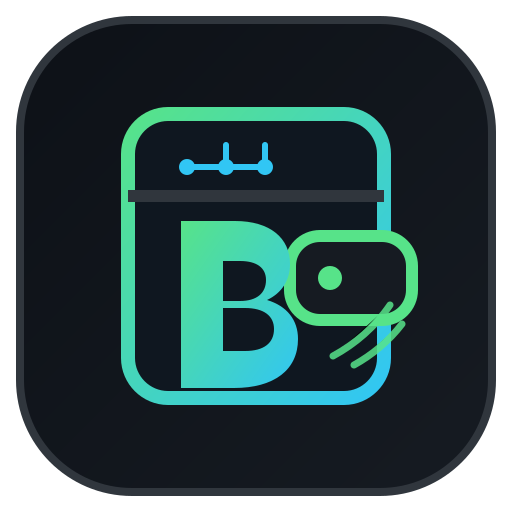

<p align="center">
  
</p>

# DIO Desafio Spring Boot + Spring AI

Assistente financeiro desenvolvido para o desafio final da trilha Spring Boot + Spring AI da DIO.

## Fluxo principal

```text
Texto ───────────────┐
                    ↓
Áudio → NVIDIA Omni → ChatClient + Tool Calling → Use Cases Java → JPA/H2 → resposta
```

A arquitetura mantém as camadas `domain`, `application` e `infrastructure`. A IA interpreta a intenção e escolhe ferramentas, enquanto as regras e operações reais continuam nos casos de uso Java.

## Uma única API NVIDIA

A versão atual usa a mesma credencial, o mesmo modelo e o mesmo endpoint NVIDIA para chat, Tool Calling e entrada de áudio:

```text
Provider: NVIDIA NIM
Base URL: https://integrate.api.nvidia.com
Endpoint: /v1/chat/completions
Modelo:   nvidia/nemotron-3-nano-omni-30b-a3b-reasoning
Chave:    NVIDIA_API_KEY
```

O fluxo de áudio não precisa de `OPENAI_API_KEY`. Arquivos WAV e MP3 são enviados ao Nemotron Omni. Áudios pequenos podem ir inline; arquivos maiores usam temporariamente o NVIDIA Cloud Functions Asset API e o asset é removido após o processamento.

> Observação: o model card oficial da NVIDIA informa suporte de idioma **English only**. A qualidade prática de fala em português deve ser validada nos testes.

## Inicialização e robustez

O starter OpenAI do Spring AI pode auto-configurar mais de um tipo de modelo. O Budget AI usa a compatibilidade OpenAI apenas para o `ChatModel` conectado à NVIDIA. Os módulos não utilizados ficam explicitamente desativados:

```properties
spring.ai.model.chat=openai
spring.ai.model.moderation=none
spring.ai.model.audio.transcription=none
spring.ai.model.audio.speech=none
spring.ai.model.embedding=none
spring.ai.model.image=none
```

Existe também um `ApplicationContextSmokeTest`, que deve falhar no CI caso o Spring Boot volte a exigir uma chave OpenAI durante o boot.

## Tratamento de erros

A aplicação possui tratamento centralizado com `@RestControllerAdvice` e `@ExceptionHandler`. Os erros REST retornam uma estrutura previsível, por exemplo:

```json
{
  "status": 502,
  "code": "AI_PROVIDER_ERROR",
  "message": "A NVIDIA recusou a credencial. Verifique sua NVIDIA API Key.",
  "path": "/api/ai/command",
  "correlationId": "...",
  "details": []
}
```

Há tratamento específico para validação, arquivo acima do limite, leitura de arquivo, erros HTTP do provedor NVIDIA, estado inesperado e fallback de erro interno. Stack traces ficam no log, não na resposta enviada à interface.

O launcher Windows também usa `try/catch` por categoria de falha, lê o log quando o backend encerra no boot e possui o botão **Abrir log**.

## Executável Windows

A release `v0.3.2-windows` contém um instalador `.exe` com Java 21 embutido e **ícone próprio do Budget AI** no pacote Windows. Depois da instalação, abra **BudgetAI** pelo menu/atalho do Windows.

O launcher:

- solicita somente a `NVIDIA_API_KEY`;
- usa o modelo NVIDIA Omni fixado;
- inicia o Spring Boot automaticamente;
- abre `http://localhost:8080`;
- mantém a chave somente na memória do processo;
- mostra diagnóstico de inicialização em caso de erro;
- possui botão **Abrir log**;
- possui botão **Login Codex**.

## Codex

O botão **Login Codex** não depende de npm. Se o Codex CLI não estiver instalado, o launcher tenta o instalador oficial para Windows e depois abre o Codex para o fluxo de autenticação.

O login do Codex é separado da `NVIDIA_API_KEY`: Codex é ferramenta de desenvolvimento; a aplicação Spring AI usa NVIDIA NIM em runtime.

## Endpoints

```text
GET  /api/system/ai-provider
POST /api/ai/command
POST /api/ai/transcribe
POST /api/ai/voice-command
GET  /api/transactions
POST /api/transactions
```

## Recursos implementados

- Java 21 + Spring Boot 4;
- Spring AI `ChatClient`;
- DDD: Domain, Application e Infrastructure;
- Spring Data JPA + H2 persistente;
- REST API;
- NVIDIA NIM;
- Nemotron Omni para texto e áudio;
- Tool Calling com funções reais da aplicação;
- transcrição de WAV/MP3;
- comando financeiro por voz;
- painel web local;
- tratamento centralizado de exceções;
- correlation ID nos erros;
- smoke test de inicialização;
- testes automatizados;
- GitHub Actions;
- instalador Windows com Java embutido;
- ícone próprio no instalador/atalhos Windows;
- logo vetorial SVG próprio.

## Desenvolvimento local

Pré-requisitos: Java 21 e Gradle.

```powershell
$env:NVIDIA_API_KEY="sua-chave-nvidia"
gradle test
gradle bootRun
```

Depois acesse `http://localhost:8080`.

## Projeto de referência da DIO

https://github.com/digitalinnovationone/dio-spring-boot-learning-track/tree/main/05-spring-ai

Esta implementação usa o projeto da trilha como referência de conceitos, mas foi estruturada e evoluída como uma solução própria para a entrega.
