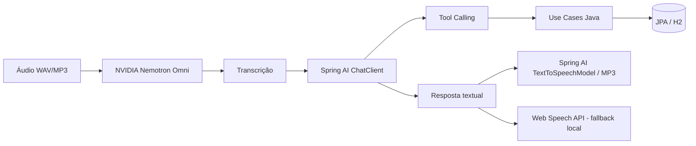

<p align="center">
  
</p>

# Budget AI — Desafio DIO Spring Boot + Spring AI

Assistente financeiro criado para o desafio final da trilha **Spring Boot + Spring AI** da DIO. O projeto recebe comandos por voz ou texto, interpreta a intenção com IA, executa **Tool Calling em casos de uso Java reais**, persiste/consulta transações e devolve uma resposta amigável — inclusive em voz.

A versão de entrega evolui o projeto de referência com painel web responsivo, NVIDIA NIM, tratamento centralizado de erros, testes, instalador Windows e fallback de voz.

## O que o projeto faz

Fluxo principal:



O `ChatClient` não grava dados diretamente. As tools chamam os mesmos casos de uso usados pela API REST, preservando as responsabilidades entre `domain`, `application` e `infrastructure`.

## Evoluções implementadas

- interface web responsiva e explicativa, priorizando o fluxo por voz;
- NVIDIA NIM / Nemotron Omni para chat e transcrição de áudio;
- Spring AI `ChatClient` + `@Tool` com funções reais;
- normalização de categorias em português/inglês para reduzir falhas de Tool Calling;
- persistência local com Spring Data JPA + H2;
- `TextToSpeechModel` real para geração de MP3 quando uma chave TTS opcional está configurada;
- fallback para Web Speech API local quando TTS externo não está configurado;
- validação de WAV/MP3, tamanho, comandos vazios e valores financeiros;
- tratamento de erros com mensagens amigáveis e `correlationId` para diagnóstico;
- testes de domínio, tools, uploads, contratos da UI e smoke test do ApplicationContext;
- instalador Windows com Java 21 embutido e ícone próprio do Budget AI.

## Arquitetura

```text
src/main/java/br/com/jaaschenbrenner/budgetai/
├── domain/           # Entidades, value objects e contratos
├── application/      # Casos de uso
└── infrastructure/
    ├── ai/           # ChatClient, NVIDIA, tools e endpoints de IA
    ├── persistence/  # JPA/H2
    ├── web/          # REST e tratamento base de erros
    └── delivery/     # UX de entrega, TTS e hardening adicional
```

### Tool Calling

As ferramentas financeiras expostas ao modelo são:

- `registrarDespesa(descricao, valorEmReais, categoria)`;
- `listarDespesas(categoria)`.

A conversão de reais para centavos e a normalização da categoria acontecem no código Java antes do caso de uso. Categorias desconhecidas são tratadas como `OUTROS`, evitando quebrar o fluxo por pequenas variações do modelo.

## Como executar

### Requisitos para desenvolvimento

- Java 21;
- Gradle;
- uma `NVIDIA_API_KEY`.

PowerShell:

```powershell
$env:NVIDIA_API_KEY="sua-chave-nvidia"
gradle clean test
gradle bootRun
```

Abra:

```text
http://localhost:8080
```

### Voz MP3 via Spring AI (opcional)

A aplicação funciona sem uma segunda chave: nesse caso, a interface usa a voz local do navegador como fallback.

Para testar o `TextToSpeechModel` real e receber MP3 pelo backend:

```powershell
$env:BUDGETAI_TTS_API_KEY="sua-chave-openai"
gradle bootRun
```

Endpoint:

```text
POST /api/ai/speech
Content-Type: application/json

{"text":"Despesa registrada com sucesso."}
```

Quando configurado, o endpoint retorna `audio/mpeg`. Sem a chave opcional, retorna erro controlado e a interface mantém o fallback local.

## Como testar o fluxo principal

1. Inicie o Budget AI e confira o indicador **IA pronta**.
2. Grave um WAV/MP3 curto, por exemplo: `Gastei 42 reais no mercado`.
3. Em **Experimente o fluxo do desafio**, selecione o áudio e clique em **Processar comando de voz**.
4. Confira a transcrição reconhecida e a resposta do assistente.
5. Verifique se a nova transação apareceu na lista.
6. Teste uma consulta: `Quais foram meus gastos com alimentação?`.
7. Teste também o comando por texto e o cadastro manual.

A interface mostra as etapas da execução sem expor JSON como experiência principal. Dados técnicos continuam disponíveis na seção recolhível **Detalhes técnicos**.

## Endpoints principais

| Método | Endpoint | Finalidade |
|---|---|---|
| GET | `/api/system/ai-provider` | estado dos provedores/capacidades |
| POST | `/api/ai/command` | comando textual para ChatClient/Tools |
| POST | `/api/ai/transcribe` | transcrever WAV/MP3 com NVIDIA |
| POST | `/api/ai/voice-command` | pipeline de voz em uma chamada |
| POST | `/api/ai/speech` | gerar MP3 com Spring AI TTS |
| GET | `/api/transactions` | listar/filtrar transações |
| POST | `/api/transactions` | criar transação manual |
| GET | `/api/transactions/categories` | categorias aceitas pelo domínio |

## Tratamento de erros

A API diferencia falhas de validação, JSON inválido, arquivo ausente, formato de áudio, limite de upload, indisponibilidade de rede, provedor externo, TTS não configurado e acesso ao banco.

Respostas de erro incluem um `correlationId` sem expor stack trace para a interface. O identificador permite localizar a exceção correspondente no log.

Exemplo:

```json
{
  "status": 400,
  "code": "INVALID_REQUEST",
  "message": "Não foi possível interpretar os dados enviados.",
  "path": "/api/transactions",
  "correlationId": "...",
  "details": []
}
```

## Testes

```powershell
gradle clean test
```

A suíte cobre, entre outros pontos:

- criação e validação de transações;
- inicialização do ApplicationContext;
- normalização de categorias;
- conversão do Tool Calling de reais para centavos;
- arquivos WAV/MP3 válidos e inválidos;
- contrato entre categorias do domínio e interface;
- presença do fluxo DIO, responsividade e TTS na UI.

O GitHub Actions executa os testes antes de produzir o instalador Windows.

## Executável Windows

A release `v0.3.5-windows` é preparada como **Delivery Candidate** e contém:

- instalador `.exe` x64;
- Java 21 embutido;
- ícone próprio do Budget AI;
- launcher para informar a chave NVIDIA;
- backend Spring Boot + painel web local.

O instalador é uma conveniência para demonstração. O código-fonte e a execução via Gradle continuam sendo a referência da entrega.

## Tecnologias

- Java 21;
- Spring Boot 4;
- Spring AI;
- Spring Data JPA;
- H2;
- NVIDIA NIM / Nemotron Omni;
- OpenAI Speech via Spring AI, opcional;
- HTML, CSS e JavaScript sem framework no painel;
- JUnit 5, AssertJ e Mockito;
- GitHub Actions;
- `jpackage` + WiX para Windows.

## O que aprendi no desafio

O principal aprendizado foi separar a responsabilidade da IA da regra de negócio. O modelo interpreta a intenção e decide quando usar uma tool, mas quem valida, cria, consulta e persiste uma transação são os casos de uso Java.

Também foi importante tratar integrações de IA como dependências externas sujeitas a falhas: credencial inválida, rede indisponível, resposta vazia e arquivo incompatível precisam gerar erros previsíveis sem corromper o estado da aplicação.

## Referência da DIO

Projeto base da trilha:

https://github.com/digitalinnovationone/dio-spring-boot-learning-track/tree/main/05-spring-ai

Esta implementação utiliza o projeto da trilha como referência conceitual e evolui a solução com escolhas próprias de arquitetura, interface, provedor de IA, testes e empacotamento.
